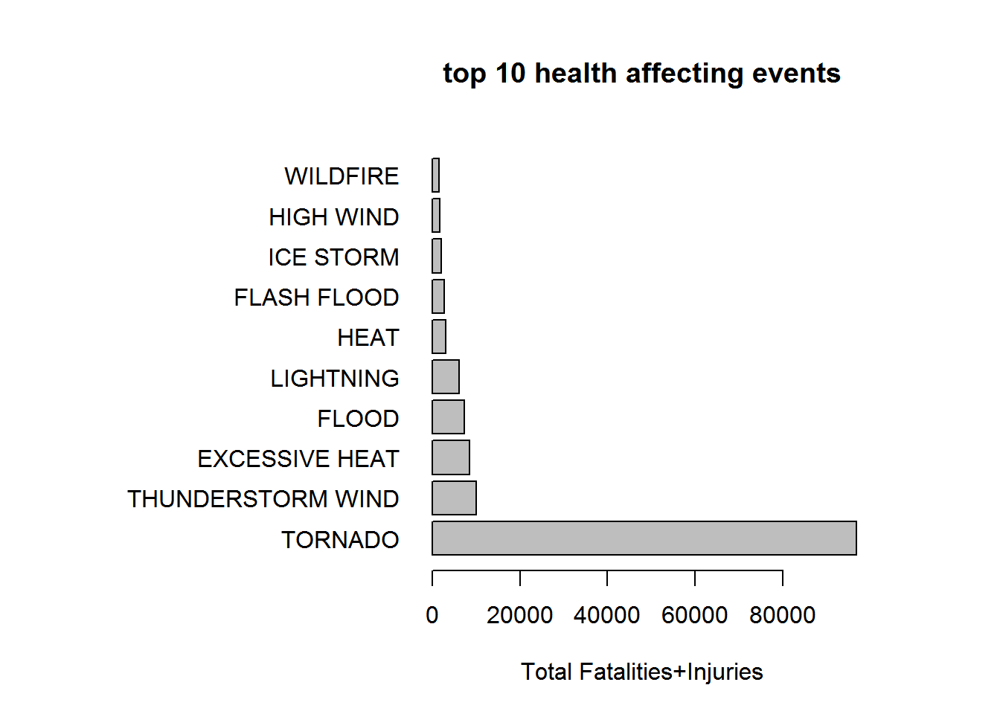
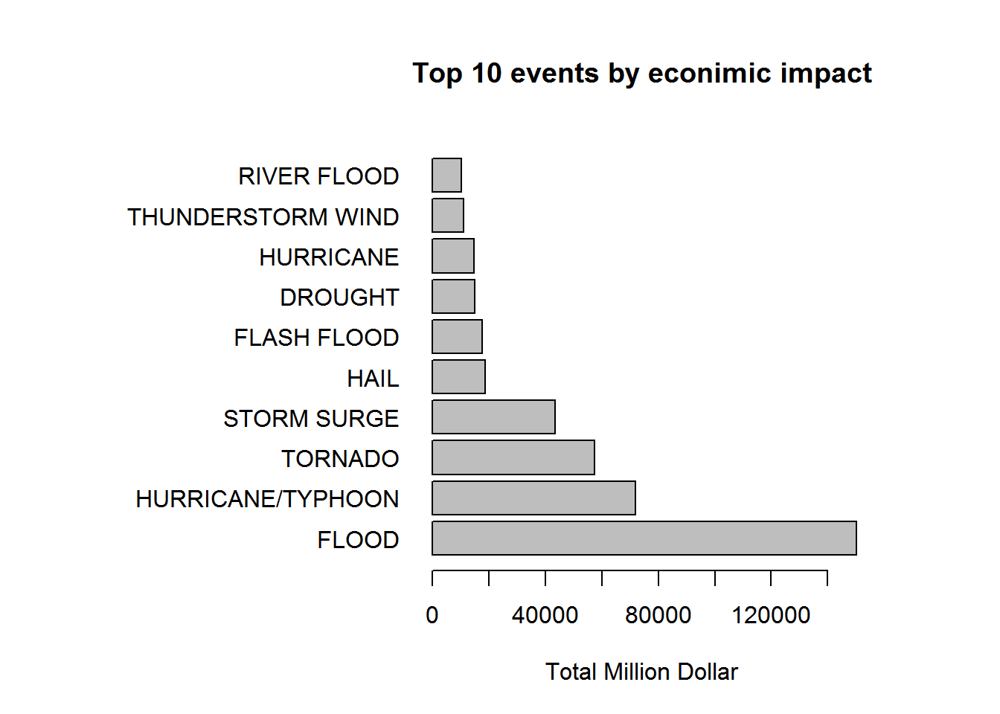

# Severe weather events analysis

## Synopsis
This data analysis concentrates on answering two questions: 1) Which types of weather events have the most harmful effect on the population health? 2) Which types of the weather events have the greatest economical consequences? Analysis is based on the data gathered by U.S. National Oceanic and Atmospheric Administration. 

## Data Processing
Source data needs to be downloaded from the following link: [Storm Data](https://d396qusza40orc.cloudfront.net/repdata%2Fdata%2FStormData.csv.bz2)

File needs to be extracted using bzip2 utility

Content can now be read into R

```r
setwd("~/R/represearch")
stormdata<-read.table(file="repdata-data-StormData.csv", sep=",", header=TRUE)
#head(stormdata)
#str(stormdata)
dim(stormdata)
```

```
## [1] 902297     37
```

```r
#levels(stormdata$PROPDMGEXP)
stormdata<-transform(stormdata,EVTYPE=as.factor(toupper(EVTYPE))) 
length(levels(stormdata$EVTYPE))
```

```
## [1] 898
```

### 1. Extract only data relevant for health issues

```r
stormhealth<-  subset ( stormdata, FATALITIES > 0 | INJURIES > 0 , select = c(EVTYPE,FATALITIES,INJURIES) )
dim(stormhealth)
```

```
## [1] 21929     3
```

```r
stormhealth$EVTYPE = as.factor (as.character (stormhealth$EVTYPE))
#levels(stormhealth$EVTYPE)
#str(stormhealth)
```
From the [Storm Data Documentation](https://d396qusza40orc.cloudfront.net/repdata%2Fpeer2_doc%2Fpd01016005curr.pdf) 2.1.1 Storm Data Event Table: extract the official event names and include into the analysis manually.

```r
evt_name<-c("Astronomical Low Tide","Avalanche","Blizzard","Coastal Flood","Cold/Wind Chill","Debris Flow","Dense Fog","Dense Smoke","Drought","Dust Devil","Dust Storm","Excessive Heat","Extreme Cold/Wind Chill","Flash Flood","Flood","Frost/Freeze","Funnel Cloud","Freezing Fog","Hail","Heat","Heavy Rain","Heavy Snow","High Surf","High Wind","Hurricane (Typhoon)","Ice Storm","Lake-Effect Snow","Lakeshore Flood","Lightning","Marine Hail","Marine High Wind","Marine Strong Wind","Marine Thunderstorm Wind","Rip Current","Seiche","Sleet","Storm Surge/Tide","Strong Wind","Thunderstorm Wind","Tornado","Tropical Depression","Tropical Storm","Tsunami","Volcanic Ash","Waterspout","Wildfire","Winter Storm","Winter Weather")

evt_name <- toupper(evt_name)
#length(evt_name)
```
Find how many event names from the official manual match the event names in the csv file

```r
matches <-  (data.frame ( EVTYPE=stormhealth$EVTYPE, EVT_NAME=evt_name[match(stormhealth$EVTYPE, evt_name)] ))
summary(matches)
```

```
##                EVTYPE                  EVT_NAME   
##  TORNADO          :7928   TORNADO          :7928  
##  LIGHTNING        :3305   LIGHTNING        :3305  
##  TSTM WIND        :2930   FLASH FLOOD      : 931  
##  FLASH FLOOD      : 931   THUNDERSTORM WIND: 682  
##  THUNDERSTORM WIND: 682   EXCESSIVE HEAT   : 678  
##  EXCESSIVE HEAT   : 678   (Other)          :3688  
##  (Other)          :5475   NA's             :4717
```

```r
mean( is.na(matches$EVT_NAME ))
```

```
## [1] 0.2151033
```

```r
#str(matches)
```
~4700 or 20% events are unmatched. This is quite a high number. Need to find out which ones didn't match. 

```r
matches$count <- 1
matches$EVT_NAME<-as.character(matches$EVT_NAME)
matches$EVT_NAME[is.na(matches$EVT_NAME)] <- c("none") 
x<-aggregate( count ~ EVTYPE + EVT_NAME , data=matches, FUN=sum )
#summary(x)
#str(x)
x<-x[order(x$count),]
```
Top unmatched event types are:

```r
tail( x[x$EVT_NAME=='none',])
```

```
##                 EVTYPE EVT_NAME count
## 92          HIGH WINDS     none    98
## 46        EXTREME COLD     none   117
## 185   WILD/FOREST FIRE     none   135
## 135       RIP CURRENTS     none   238
## 156 THUNDERSTORM WINDS     none   359
## 169          TSTM WIND     none  2930
```
Will fix the top unmatched Event types

```r
stormhealth$EVTYPE[stormhealth$EVTYPE=="TSTM WIND"]<-"THUNDERSTORM WIND"
stormhealth$EVTYPE[stormhealth$EVTYPE=="THUNDERSTORM WINDS"]<-"THUNDERSTORM WIND"
stormhealth$EVTYPE[stormhealth$EVTYPE=="RIP CURRENTS"]<-"RIP CURRENT"
stormhealth$EVTYPE[stormhealth$EVTYPE=="WILD/FOREST FIRE"]<-"WILDFIRE"
stormhealth$EVTYPE[stormhealth$EVTYPE=="EXTREME COLD"]<-"EXTREME COLD/WIND CHILL"
stormhealth$EVTYPE[stormhealth$EVTYPE=="HIGH WINDS"]<-"HIGH WIND"
matches <-  (data.frame ( EVTYPE=stormhealth$EVTYPE, EVT_NAME=evt_name[match(stormhealth$EVTYPE, evt_name)] ))
```
Percentage of unmatched values is now:

```r
mean( is.na(matches$EVT_NAME ))
```

```
## [1] 0.03830544
```
This is acceptible for further research

Now the data will be aggreated and top 10 event types with respect to human health displayed.


```r
agg_storm_h<-aggregate ( FATALITIES+INJURIES~EVTYPE, data=stormhealth, FUN=sum )
agg_storm_h<-agg_storm_h[ order( agg_storm_h$"FATALITIES + INJURIES" , decreasing = TRUE ),]
head(agg_storm_h, n=10)
```

```
##                EVTYPE FATALITIES + INJURIES
## 165           TORNADO                 96979
## 155 THUNDERSTORM WIND                 10054
## 27     EXCESSIVE HEAT                  8428
## 40              FLOOD                  7259
## 109         LIGHTNING                  6046
## 60               HEAT                  3037
## 35        FLASH FLOOD                  2755
## 103         ICE STORM                  2064
## 81          HIGH WIND                  1722
## 189          WILDFIRE                  1543
```

### 2. Extract data relavant for economical consequences

Extract econimicaly relevant data

```r
stormeconomic <-  subset ( stormdata, PROPDMG > 0 | CROPDMG > 0 , select = c(EVTYPE,PROPDMG,PROPDMGEXP,CROPDMG,CROPDMGEXP) )
dim(stormeconomic)
```

```
## [1] 245031      5
```

```r
stormeconomic$EVTYPE = as.factor (as.character (stormeconomic$EVTYPE))
```

Find the top unmatched events

```r
matches <-  (data.frame ( EVTYPE=stormeconomic$EVTYPE, EVT_NAME=evt_name[match(stormeconomic$EVTYPE, evt_name)] ))
summary(matches)
```

```
##                 EVTYPE                   EVT_NAME    
##  TSTM WIND         :61476   THUNDERSTORM WIND:43465  
##  THUNDERSTORM WIND :43465   TORNADO          :39361  
##  TORNADO           :39361   HAIL             :25969  
##  HAIL              :25969   FLASH FLOOD      :20659  
##  FLASH FLOOD       :20659   LIGHTNING        :10360  
##  THUNDERSTORM WINDS:12005   (Other)          :26212  
##  (Other)           :42096   NA's             :79005
```

```r
mean( is.na(matches$EVT_NAME ))
```

```
## [1] 0.3224286
```
Approx 32% didn't match. Let's find out which ones are in top

```r
matches$count <- 1
matches$EVT_NAME<-as.character(matches$EVT_NAME)
matches$EVT_NAME[is.na(matches$EVT_NAME)] <- c("none") 
x<-aggregate( count ~ EVTYPE + EVT_NAME , data=matches, FUN=sum )
#summary(x)
#str(x)
x<-x[order(x$count),]
tail( x[x$EVT_NAME=='none',])
```

```
##                   EVTYPE EVT_NAME count
## 370     WILD/FOREST FIRE     none   323
## 345       TSTM WIND/HAIL     none   429
## 173           HIGH WINDS     none   611
## 361 URBAN/SML STREAM FLD     none   675
## 295   THUNDERSTORM WINDS     none 12005
## 331            TSTM WIND     none 61476
```
Will fix top ones

```r
stormeconomic$EVTYPE[stormeconomic$EVTYPE=="TSTM WIND"]<-"THUNDERSTORM WIND"
stormeconomic$EVTYPE[stormeconomic$EVTYPE=="THUNDERSTORM WINDS"]<-"THUNDERSTORM WIND"
stormeconomic$EVTYPE[stormeconomic$EVTYPE=="RIP CURRENTS"]<-"RIP CURRENT"
stormeconomic$EVTYPE[stormeconomic$EVTYPE=="WILD/FOREST FIRE"]<-"WILDFIRE"
stormeconomic$EVTYPE[stormeconomic$EVTYPE=="EXTREME COLD"]<-"EXTREME COLD/WIND CHILL"
stormeconomic$EVTYPE[stormeconomic$EVTYPE=="HIGH WINDS"]<-"HIGH WIND"
stormeconomic$EVTYPE[stormeconomic$EVTYPE=="TSTM WIND/HAIL"]<-"THUNDERSTORM WIND"
matches <-  (data.frame ( EVTYPE=stormeconomic$EVTYPE, EVT_NAME=evt_name[match(stormeconomic$EVTYPE, evt_name)] ))
summary(matches)
```

```
##                EVTYPE                    EVT_NAME     
##  THUNDERSTORM WIND:117375   THUNDERSTORM WIND:117375  
##  TORNADO          : 39361   TORNADO          : 39361  
##  HAIL             : 25969   HAIL             : 25969  
##  FLASH FLOOD      : 20659   FLASH FLOOD      : 20659  
##  LIGHTNING        : 10360   LIGHTNING        : 10360  
##  FLOOD            : 10058   (Other)          : 27251  
##  (Other)          : 21249   NA's             :  4056
```

```r
mean( is.na(matches$EVT_NAME ))
```

```
## [1] 0.01655301
```

Unmathed events are down to ~2%. This is acceptable for further analysis.

Aggregate data to get the top 10 event types with highest econimical impact

```r
stormeconomic$totalpropdmg <- ifelse ( stormeconomic$PROPDMGEXP=='B', stormeconomic$PROPDMG * 10^9,
                                ifelse ( stormeconomic$PROPDMGEXP=='M', stormeconomic$PROPDMG * 10^6,
                                  ifelse ( stormeconomic$PROPDMGEXP=='K', stormeconomic$PROPDMG * 10^3,
                                    ifelse ( stormeconomic$PROPDMGEXP=='H', stormeconomic$PROPDMG * 10^2, 0 
                                    )
                                  )
                                )
                              )
stormeconomic$totalcropdmg <- ifelse ( stormeconomic$CROPDMGEXP=='B', stormeconomic$CROPDMG * 10^9,
                                ifelse ( stormeconomic$CROPDMGEXP=='M', stormeconomic$CROPDMG * 10^6,
                                  ifelse ( stormeconomic$CROPDMGEXP=='K', stormeconomic$CROPDMG * 10^3,
                                    ifelse ( stormeconomic$CROPDMGEXP=='H', stormeconomic$CROPDMG * 10^2, 0 
                                    )
                                  )
                                )
                              )
                                   
agg_econ <- aggregate ( (totalcropdmg + totalpropdmg)/10^6 ~ EVTYPE, data = stormeconomic, FUN=sum ) 
colnames( agg_econ)[2] <- "total_mln"
str(agg_econ)
```

```
## 'data.frame':	390 obs. of  2 variables:
##  $ EVTYPE   : Factor w/ 397 levels "   HIGH SURF ADVISORY",..: 1 2 3 4 5 6 7 8 9 10 ...
##  $ total_mln: num  0.2 0.05 8.1 0.008 0.005 ...
```

```r
agg_econ <- agg_econ[order(agg_econ$"total_mln", decreasing=TRUE),]
head(agg_econ,n=10)
```

```
##                EVTYPE total_mln
## 65              FLOOD 150319.68
## 178 HURRICANE/TYPHOON  71913.71
## 321           TORNADO  57340.61
## 270       STORM SURGE  43323.54
## 100              HAIL  18752.90
## 52        FLASH FLOOD  17562.13
## 35            DROUGHT  15018.67
## 170         HURRICANE  14610.23
## 282 THUNDERSTORM WIND  10970.07
## 236       RIVER FLOOD  10148.40
```

## Results 
### 1. Top 10 events with respect to the population healt are:

```r
par(mai=c(1,3,1,1))
barplot ( head ( agg_storm_h$"FATALITIES + INJURIES", n=10) , main="top 10 health affecting events", names.arg=head(agg_storm_h$EVTYPE,n=10), xlab="Total Fatalities+Injuries" , horiz=TRUE , las=1)
```

 

### 2. Top 10 events with respect to economical impact are:

```r
par(mai=c(1,3,1,1))
barplot( head ( agg_econ$"total_mln", n=10), names.arg=head (agg_econ$EVTYPE,n=10),  main="Top 10 events by econimic impact" , las=1, horiz=TRUE, xlab='Total Million Dollar')
```

 


